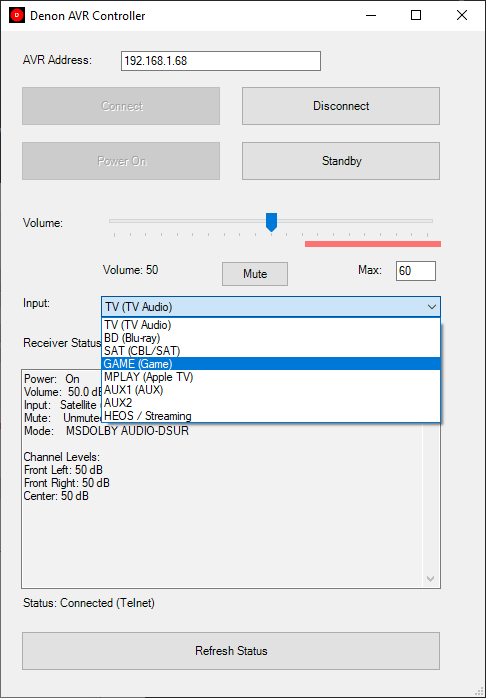

# Denon AVR Controller

A simple tool to control a Denon or Marantz network receiver over LAN from your Windows PC/Laptop. Uses Telnet (TCP port 23).



## Requirements

- Windows PowerShell 5.1
- [.NET Framework](https://dotnet.microsoft.com/download/dotnet-framework) (WinForms assemblies load at runtime)
- Tested against a Denon X1600H Receiver but should work on a broad range of Denon and Marantz models
- Enable Settings -> Network -> Network control on the receiver settings

## Run without building

From the repo root:

```powershell
powershell -ExecutionPolicy Bypass -File .\src\DenonAVR.standalone.ps1
```

Ensure no other application has the receiver’s TCP control session open at the same time (many units allow only **one** client).

## Build a standalone `.exe`

1. Install ps2exe (once):

   ```powershell
   Install-Module ps2exe -Scope CurrentUser -Repository PSGallery -Force
   ```

2. From the repo root:

   ```powershell
   .\scripts\Build.ps1
   ```

The executable is written to `release\DenonAVR.exe`.

## Disclaimer

This is unofficial hobby software—not affiliated with Sound United, Denon, or Marantz. Use at your own risk.
